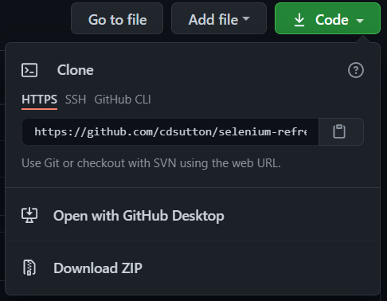
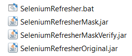
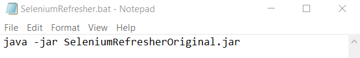
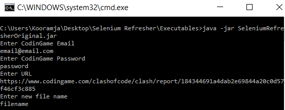
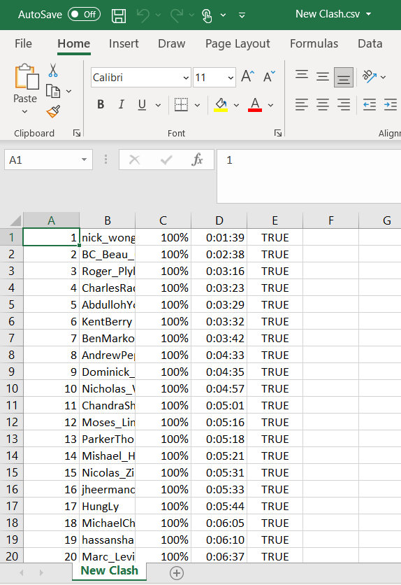

# Selenium Refresher: CodinGame Automation

## Project Description

A product that automates the web browser to log-on to CodinGame and obtain a user-requested Clash Report in the form of a .csv file. This product can be accessed through an executable JAR file with an extra step covered by simply clicking on a batch file to run the product. There is also an option to mask the user's password for security purposes. Overall, this product was meant to help the developer improve on their knowledge and skills in Selenium.

## Technologies Used
* Git
* Java
* Maven
* OpenCSV
* Selenium
* WebDriverManager

## Features
### List of features ready:
* Login Functionality! - To be able to access Clash Reports and Shared Code!
* Mask Password Input! - To protect user credentials at a in-person level!
* Headless Mode! - To allow for multitasking while the automation executes as well as a boost in speed and performance!
* Batch File! - To automate the task of executing the JAR file in the Command Window!

## Usage

### Step 1
#### To download the project:
* Git Clone the Repository
* Open it in GitHub Desktop
* Download the Zip Folder

### Step 2
#### Go into the Executables Folder and you will see the SeleniumRefresher.bat file along with some JAR files.
* Editing the .bat file helps in identifying which JAR file should be executed.

### Step 2.5
#### Right-click the .bat file and select Edit, then change the name of the current JAR file to the desired version.
* SeleniumRefresherOriginal will allow the user to see what password they are inputting. (Default)
* SeleniumRefresherMaskVerify will mask the password the user inputs, but after submitting will be shown the password they just inputted.
* SeleniumRefresherMask will only mask the password the user inputs, no way of verifying what was inputted.

### Step 3
#### Double-click the .bat file and input the necessary details to obtain the CodinGame Clash Results.
* Enter your CodinGame Email.
* Enter your CodinGame Password.
* Enter the URL of the CodinGame Report you wish to obtain.
* Enter the filename you wish to name your CSV file.

### Step 4
#### Enjoy your automated results!

